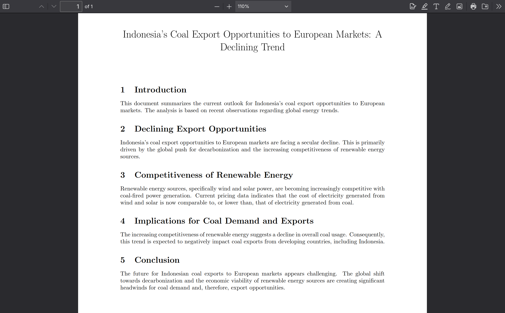

  
  <h1 align="center">SimuTrade</h1>

   
## 📘 Project Overview
SimuTrade is an AI-powered Trade Supply Chain Simulation designed to deliver a seamless and interactive user experience.

SimuTrade is deployed on [simutrade.app](https://simutrade.app) and it's API (Back End) deployed on [api.simutrade.app](https://api.simutrade.app)

SimuTrade Frontend Repository: [https://github.com/simutrade-app/simutrade-fe](https://github.com/simutrade-app/simutrade-fe) 
SimuTrade API Backend Repository: [https://github.com/simutrade-app/simutrade-api](https://github.com/simutrade-app/simutrade-api) 
SimuTrade RAG + AI Backend Repository: [https://github.com/simutrade-app/simutrade-ai](https://github.com/simutrade-app/simutrade-ai)

  
  
  
  
  
  
  
  
  
  

## 🧱 Tech Stack Overview

### 🖥️ Frontend

- **React**: A popular JavaScript library for building dynamic user interfaces using components.
- **Vite**: A fast development server and build tool optimized for modern JavaScript and TypeScript projects.
- **TypeScript**: A statically typed superset of JavaScript that improves code quality and maintainability.
- **Tailwind CSS**: A utility-first CSS framework for building custom and responsive UIs efficiently.
- **Radix UI**: A library of unstyled, accessible React primitives for building complex UI components.
- **Ant Design (antd)**: A comprehensive React UI component library with a sleek design system.
- **React Hook Form**: A lightweight and performant library for handling forms and validation in React.
- **Zod**: A TypeScript-first schema validation library used for parsing and validating inputs.
- **React Router DOM**: A routing library for managing navigation and routes in single-page applications.
- **TanStack React Query**: A tool for fetching, caching, and syncing asynchronous data in React.
- **Socket.IO Client**: A real-time communication library for bidirectional event-based interactions with a server.
- **Axios**: A promise-based HTTP client for making requests from the browser or Node.js.
- **Recharts**: A charting library built with React for rendering composable and responsive charts.
- **Leaflet + React Leaflet**: A lightweight JavaScript library for interactive maps, extended with React bindings.
- **Lucide React & Font Awesome**: Icon libraries providing customizable and scalable vector icons for interfaces.
- **GSAP**: A performance-focused animation library for crafting high-quality motion effects.
- **Embla Carousel**: A lightweight React carousel for touch-friendly sliders.
- **Prettier + ESLint**: Tools for code formatting and linting to ensure consistency and code quality.
- **PostCSS + Tailwind Plugins**: Tools for processing CSS and extending Tailwind’s capabilities.
- **Vaul & Sonner**: Components and libraries for modals and toast notifications with accessible UX.
- **date-fns**: A modern JavaScript date utility library using pure functions.
- **React Markdown & Resizable Panels**: Libraries for rendering markdown and building adjustable layouts.

### 🧠 RAG + AI Backend

- **FastAPI**: A high-performance Python web framework for building APIs quickly with automatic OpenAPI docs.
- **Google Gemini**: A multimodal large language model developed by Google for advanced reasoning and generative capabilities.
- **Google Vertex AI Search**: A managed enterprise-grade service for semantic search over structured and unstructured data.
- **Chroma DB**: An open-source vector database designed for storing and querying high-dimensional embeddings.
- **LangChain**: A framework for orchestrating language model pipelines, tools, memory, and retrieval strategies.
- **MiniLM Sentence Transformer**: A compact transformer model used for generating high-quality sentence embeddings efficiently.

### 🧩 API Backend

- **Node.js**: A fast and scalable JavaScript runtime built on Chrome’s V8 engine.
- **Express.js**: A minimalist web application framework for building REST APIs and backend services.
- **MongoDB**: A flexible NoSQL database that stores data in JSON-like documents.
- **Docker**: A platform for packaging applications into containers to ensure consistent environments across systems.
- **Cloudflare R2**: An S3-compatible object storage service with zero egress fees and global distribution.
- **OpenRouter.ai**: An AI API gateway that aggregates multiple language models like Gemma and Gemini under a unified interface.
- **pdflatex**: A LaTeX engine for compiling LaTeX source files into high-quality PDFs.

## 📝 License
This project is licensed under the MIT License.